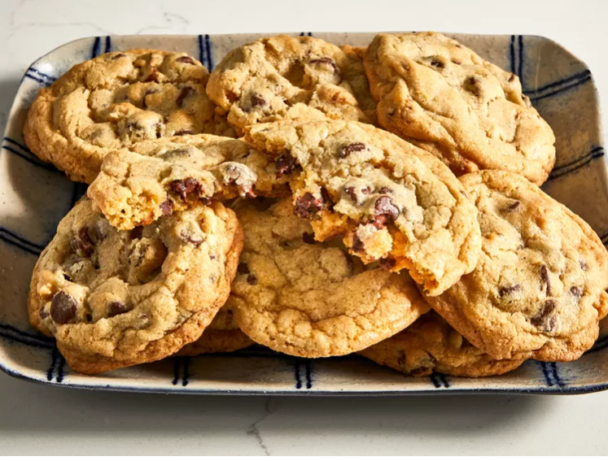
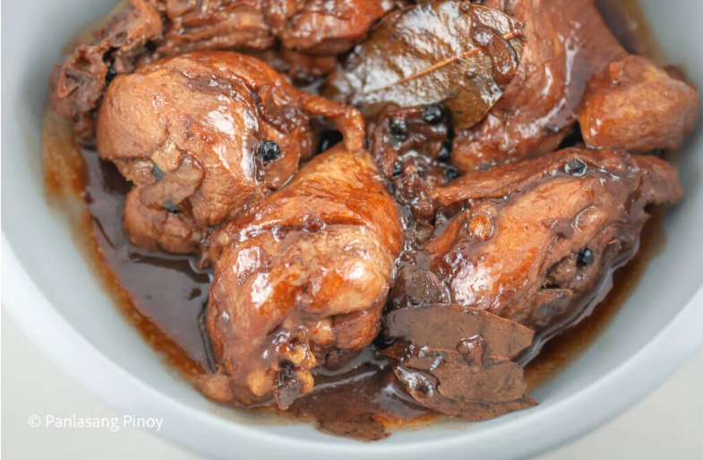
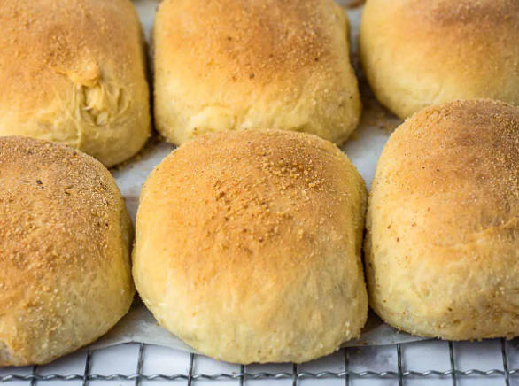
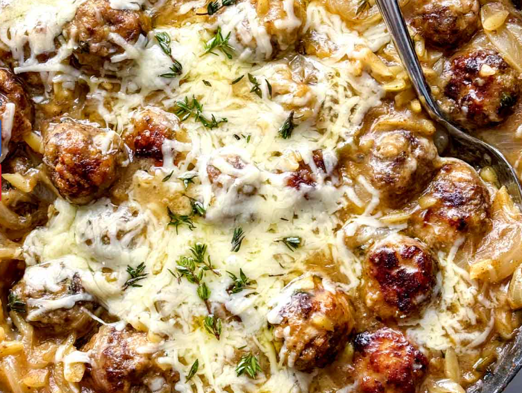

::: {style="text-align: center;"}
<h2>My Favorite Recipes</h2>
:::

## Chocolate Chip Cookies

::: contact-box
[Open recipe](https://www.allrecipes.com/recipe/10813/best-chocolate-chip-cookies/)
:::

These are my all time favorite chocolate chip cookies. I always used this recipe for team banquets in high school and my teammates would fill entire bowls. I think I mainly liked these cookies since they reminded me a lot of this cookie shop that used to be in our local mall that sadly closed down during COVID19. These cookies were the closest thing I could find the replicate the legendary cookies from Cookies Cookery. Additionally, when I moved out, my Grandmother continues to make this recipe so my family can enjoy them while I am gone!

## Chicken Adobo **Filipino**

{width="686"}

::: contact-box
[Open recipe](https://panlasangpinoy.com/filipino-chicken-adobo-recipe/)
:::

A staple meal in Filipino cooking, chicken adobo is one of my favorite dishes because it keeps me connected to my grandmother’s cooking now that I live away from home. I love making it because it is comforting, flavorful, and surprisingly easy to prepare

## Pandesal

{width="693" height="507"}

::: contact-box
[Open recipe](https://www.rivertenkitchen.com/soft-buttery-pandesal.html)
:::

Since I live in a small town where pandesal is hard to find unless it is brought in from bakeries in Los Angeles, having this recipe feels especially important. Pandesal is one of the most versatile breads to have around because it works perfectly for sandwiches, breakfast, or as a side with almost any meal.

## Creamy French Onion Orzo

{width="679" height="472"}

::: contact-box
[Open recipe](https://www.delish.com/cooking/recipe-ideas/a63637314/creamy-french-onion-orzo-recipe/)
:::

I made this recipe once and it was such a hit that it quickly became one of my go-to meals. Since then, I’ve made it over and over again, and it has stayed one of my favorite meals of all time because it’s rich, comforting, and always turns out well.
