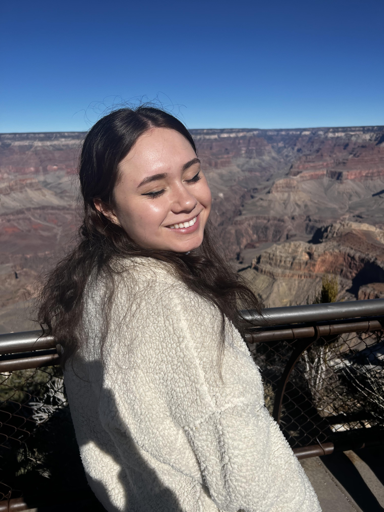

#  

::: text-center
## Hi, I’m Rylee!
:::

{fig-align="center" width="269"}

I'm and Environmental Studies Student at UCSB interested in GIS, Environmental Justice and politics, and how we can utilize spacial tools to understand real-world issues. This website acts as a personal online portfolio where I can share some of the projects I've worked on, along with information about my interest, experiences, and the skills I've been developing. Through these pages, I hope to highlight ways I use mapping, data, and environmental analysis to explore and communicate interesting environmental topics.

::: grid

## Quick links

-   [About](about.qmd)
-   [Projects](projects.qmd)
-   [Resume](resume.qmd)
-   [Free-for-all](free.qmd)
:::

## Contact me! 

::: contact-box
[📧 Email](mailto:ryleesheils@gmail.com)
:::

::: contact-box
[💻 GitHub](https://github.com/ryleesheils)
:::

::: contact-box
🗺 **ArcGIS Map Project**

View my interactive soil permeability map of landfill sites surrounding the Calabasas and Chiquita Canyon landfills.

[Open interactive map](https://ucsb.maps.arcgis.com/apps/mapviewer/index.html?webmap=0b3d2ab4d0db4366ba75797c5de89537)
:::
