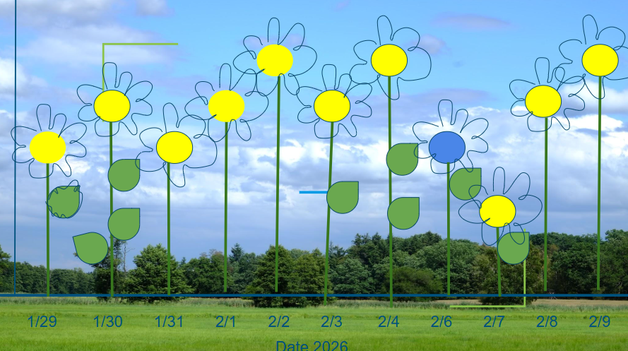

This project comes from my personal data assignment, where I worked with a data set I collected myself and used R to explore patterns through visualization. I wanted to understand how different daily factors relate to my reported energy level, and then think about how those patterns could be translated into a more expressive affective visualization.

# Data visualization: Energy by Cloud Cover

The first figure explores how my daily energy level varied across different cloud cover conditions. I used a combination of boxplots and jittered points so that the figure would show both the overall distribution within each category and the individual observations in the data set.

## Step 1. Set Up

```{r}
#| label: Load Data and Wrangle
#| message: false
#| warning: false
library(tidyverse) #load in tidyverse package
library(here) #load in here
library(janitor) #load in janitor 

personal <- read_csv(here("data", "ENVSdsresearch.csv")) |> #create new data set called personal using my ENVSdsresearch.csv 
  clean_names() |> #clean names 
  mutate(date = as.Date(date, format = "%m/%d/%Y")) #change date format in table 
```

Here I loaded in the packages that I used to create my project. This includes, tidyverse, here, and janitor. I then read in my ENVS research data into a new data frame called "personal."

Under this, I cleaned and wrangled the data names and formatted the date to be xm/xd/xy.

## Step 2. Creating necessary data frame

```{r}
#| label: Create Necessary Data Frame
#| message: false
#| warning: false
latest_date <- max(personal$date, na.rm = TRUE) # create new data frame called latest_date that establishes the last date that data was collected
```

Although this step seems small, it is important to create the data frames we will recall in the upcoming code chunks.

## Step 3. Creating Visualization with Code

```{r}
#| label: Jitter Plot Cloud Cover
#| message: false
#| warning: false
ggplot(personal, aes(x = cloud_cover, y = energy_level_1_5, color = cloud_cover)) + #load in data and assign x, y varaibles.
  geom_boxplot(alpha = 0.25, outlier.shape = NA) + #shaping geom boxplot
  geom_jitter(width = 0.15, size = 2.5, alpha = 0.7) + #sizing for jitter plot
  labs( 
    title = "Daily Energy Level by Cloud Cover", #title
    subtitle = paste("Most recent observation:", latest_date), #subtitle with latest date of recorded observations
    x = "Cloud cover",
    y = "Energy Level (1–5)" #label x and y axis 
  ) +
  scale_color_brewer(palette = "Dark2") + #color palate and theme selections
  theme_minimal() +
  theme(legend.position = "none")
```

This figure shows how my reported daily energy level changed across different cloud cover conditions in my personal dataset. The x-axis groups days by cloud cover category, while the y-axis shows energy level on a 1–5 scale.

Each colored point represents an individual observation. The boxplots summarize the distribution within each category by showing the median, the middle 50% of values, and the overall spread of the data. From this plot, it looks like energy levels were generally highest on mostly clear days, where the median appears around 4 and the values are spread across a relatively wide range. Cloudy days also show moderate to somewhat high energy levels, with a median around the mid-3 range. In contrast, cloudy/rainy days appear to be associated with somewhat lower energy levels overall, and partly cloudy has very limited data, so it is harder to interpret confidently.

Overall, the plot suggests that clearer weather may have been associated with higher self-reported energy in this dataset, although the number of observations differs across categories, so the results should be interpreted cautiously.

# Why I chose this project

I chose this project because on days when I feel especially tired, I often blame the weather or the fact that the sun is blocked by clouds. That made me curious about whether this feeling actually matched the patterns in my daily life, so I wanted to chart the relationship between my energy level and cloud cover using my own personal data.

What I found was interesting because, across the 30 days I recorded, most of the days were actually fairly sunny. Even so, the visualization still gave me a way to think more critically about whether weather really shapes how energetic I feel, or whether I just notice cloudy days more when I am already tired. At the same time, I realized that expanding the time frame of data collection would likely improve the accuracy of the project and make any patterns more reliable.

# Affective Visualization



For the affective portion of the project, I re imagined the data as a field of flowers, where each flower represented one day of observations. The design used flower height, petal shape, color, and leaves to encode different variables from the dataset in a more visual and expressive way.
